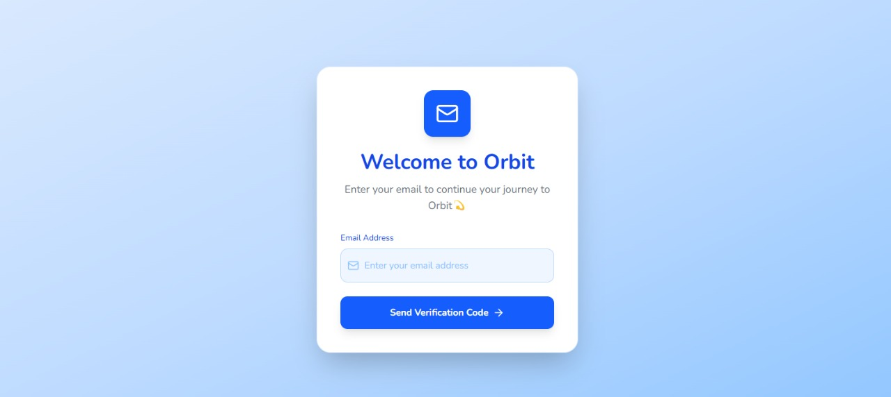
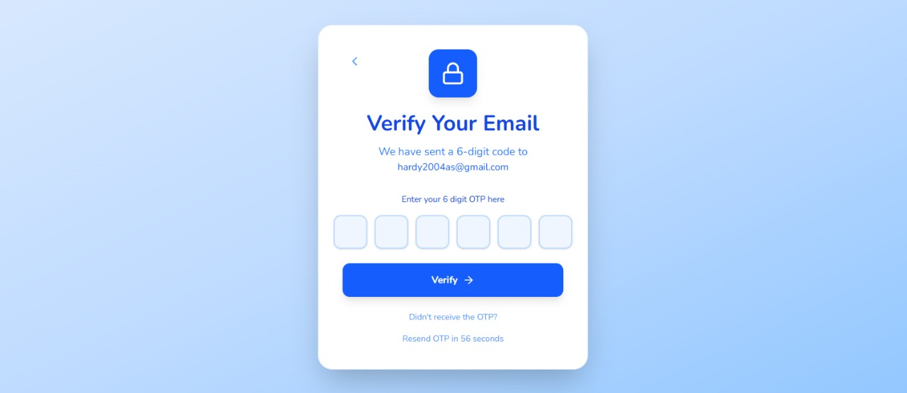
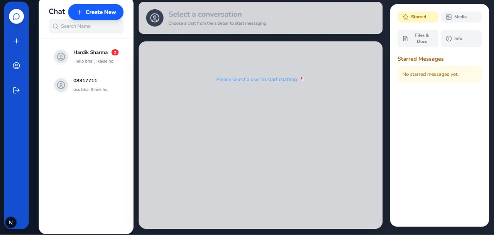
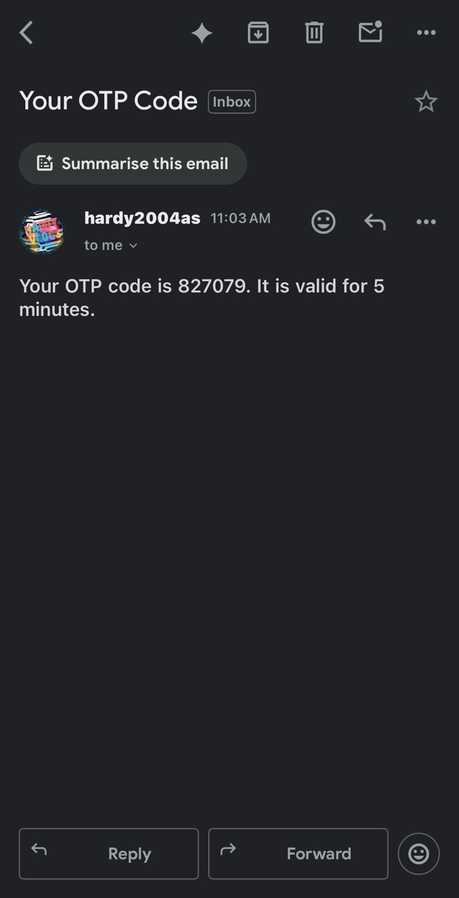

# Orbit - Realtime Chat Application

Orbit is a microservices-based, scalable, full-stack realtime chat application built with Next.js, Node.js, Express, MongoDB, Socket.io, RabbitMQ, and Redis. It features a beautiful, responsive UI, secure authentication, and real-time messaging.

## Features

- Microservices architecture for scalability and reliability
- Modern glassmorphism UI with gradients and animations
- Realtime messaging with Socket.io
- Secure authentication with OTP verification
- Profile management with avatar support
- Media, files, and starred messages
- Responsive design for desktop and mobile

## Screenshots

### 1. Login Page



### 2. OTP Verification



### 3. Main Chat UI



### 4. Email OTP Example



> **Note:** Place the images in a `docs/` folder at the root of your project for correct rendering on GitHub.

## Technologies Used

- **Frontend:** Next.js, React, Tailwind CSS
- **Backend:** Node.js, Express, MongoDB, Mongoose
- **Realtime:** Socket.io
- **Authentication:** OTP via Email
- **File Uploads:** Multer, Cloudinary
- **Microservices Communication:** RabbitMQ
- **Caching & Pub/Sub:** Redis

## Tool & Component Overview

### Frontend Tools & Components

- **Next.js**: React framework for server-side rendering, routing, and fast builds.
- **React**: UI library for building interactive user interfaces.
- **Tailwind CSS**: Utility-first CSS framework for rapid UI development and custom styling.
- **AppContext**: Global state management for user, chat, and authentication data.
- **SocketContext**: Manages real-time socket connections for chat updates.
- **ChatSideBar**: Displays user list, chat list, online status, and allows starting new chats.
- **ChatHeader**: Shows selected user's info, online status, and chat actions.
- **ChatMessages**: Renders chat messages, supports animations, and message status.
- **MessageInput**: Input field for sending messages, with typing indicator and file upload.
- **VerifyOTP**: Handles OTP verification for secure login.
- **Loading**: Animated loading spinner for async operations.

### Backend Tools & Services

- **Node.js**: JavaScript runtime for building scalable server-side applications.
- **Express**: Web framework for routing, middleware, and REST APIs.
- **MongoDB & Mongoose**: NoSQL database and ODM for storing users, chats, and messages.
- **Socket.io**: Enables real-time, bidirectional communication for instant messaging.
- **Multer**: Middleware for handling file uploads (profile pictures, media).
- **Cloudinary**: Cloud service for storing and serving uploaded images.
- **JWT (JSON Web Token)**: Used for secure authentication and session management.
- **Nodemailer**: Sends OTP emails for user verification.
- **RabbitMQ**: Message broker for microservices communication (e.g., mail service, notifications).
- **Redis**: In-memory data store for caching, pub/sub, and fast data access.

### Key Functions & Endpoints

- **User Authentication**: Register, login, OTP verification, JWT token management.
- **Profile Management**: Update name, upload/remove avatar, view profile.
- **Chat Management**: Create chat, send/receive messages, mark as read/unread, star messages.
- **Media & Files**: Upload, view, and download media/files in chat.
- **Online Status**: Real-time user presence indicator using Socket.io.
- **Microservices**: Decoupled services for user, chat, mail, notifications, scaling via RabbitMQ and Redis.

## Getting Started

### Prerequisites

- Node.js & npm
- MongoDB
- RabbitMQ
- Redis

### Installation

1. Clone the repository:
   ```bash
   git clone https://github.com/yourusername/orbit-chat-app.git
   cd orbit-chat-app
   ```
2. Install dependencies for frontend and backend:
   ```bash
   cd backend/user
   npm install
   cd ../chat
   npm install
   cd ../mail
   npm install
   cd ../../frontend/my-app
   npm install
   ```
3. Set up environment variables for backend (MongoDB URI, Cloudinary, RabbitMQ, Redis, etc.)
4. **Start each microservice separately:**
   - In `backend/user`:
     ```bash
     npm run dev
     ```
   - In `backend/chat`:
     ```bash
     npm run dev
     ```
   - In `backend/mail`:
     ```bash
     npm run dev
     ```
   - In `frontend/my-app`:
     ```bash
     npm run dev
     ```

> **Note:** All microservices (user, chat, mail) must be running for the app to work correctly.

## Folder Structure

```
backend/
  chat/
  mail/
  user/
frontend/
  my-app/
```

## Contributing

Pull requests are welcome! For major changes, please open an issue first to discuss what you would like to change.

## License

This project is licensed under the MIT License.

---

## Demo

Try the app locally or deploy to Vercel/Heroku for a live demo.

---

## Contact

For any queries, reach out to [hardik2004s@gmail.com](mailto:hardik2004s@gmail.com)
